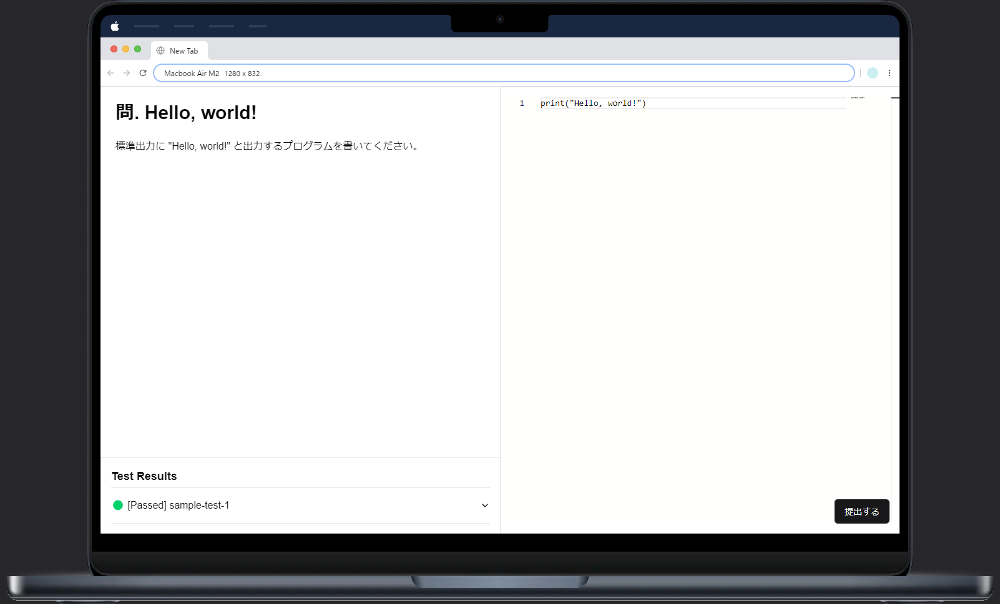

# デモ



## 実装している機能

- **バックエンド**
  - `POST /api/v1/run`: 与えられたプログラムを実行する
  - `POST /api/v1/grade`: 与えられた問題に対して、与えられたプログラムを実行して、その結果を返す
- **フロントエンド**
  - `/problems/sample-problem`: サンプルの問題ページ
    - [x] 問題文を表示
    - [x] プログラムを入力するエディタ
    - [x] プログラムを実行するボタン
    - [x] テストの実行結果を表示

## 開発

### 必要なもの

- [Rust](https://www.rust-lang.org/)
- [Bun](https://bun.sh)

### 起動方法

1. **バックエンドサーバーを起動する**

   ```sh
   cd backend
   cargo run --release
   ```

2. **フロントエンドサーバーを起動する**

   ```sh
   cd frontend
   bun install --frozen-lockfile
   bun run dev
   ```

### 動作確認

#### フロントエンド

`http://localhost:3000/problems/sample-problem` にアクセスし、問題ページを表示できることを確認してください。

#### バックエンド

プログラムを実行する：

```sh
$ curl --request POST \
  --url http://localhost:5000/api/v1/run \
  --header 'Content-Type: application/json' \
  --data '{
    "language": "Python",
    "program": {
      "code": "print('\''Hello, world'\'')"
    },
    "input": {
      "stdin": ""
    }
  }'
{
  "stdout": "Hello, world\n",
  "stderr": ""
}
```

問題（`sample-problem`）を解く：

```sh
$ curl --request POST \
  --url http://localhost:5000/api/v1/grade \
  --header 'Content-Type: application/json' \
  --data '{
    "problem_id": "sample-problem",
    "language": "Python",
    "program": {
      "code": "print('\''Hello, world!'\'')"
    }
  }'
{
  "problem_id": "sample-problem",
  "test_results": [
    {
      "test_id": "sample-test-1",
      "status": "Passed",
      "actual": "Hello, world!\n",
      "expected": "Hello, world!\n",
      "stderr": ""
    }
  ]
}
```
